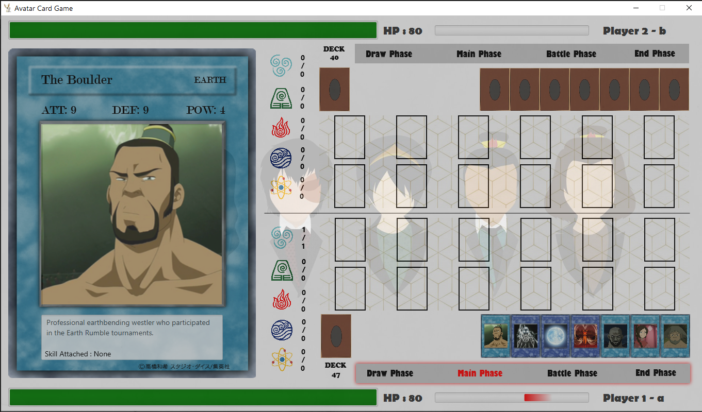
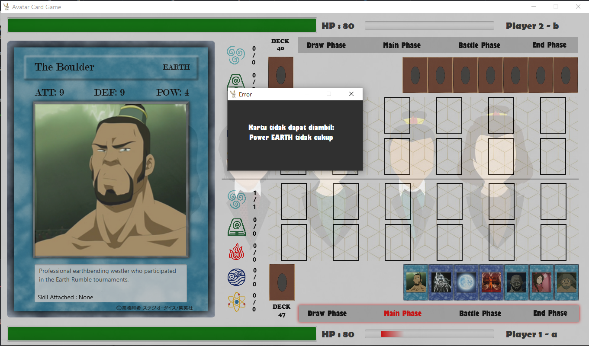

# Avatar-CardGame

Card game using Avatar: The Last Airbender characters

## Authors

### K03-G05

* **Arief Darmawan Tantriady** - 13518015
* **Tony Eko Yuwono** - 13518030
* **Muh. Muslim Al Mujahid** - 13518054
* **Yan Arie Motinggo** - 13518129
* **Fabianus Harry Setiawan** - 13518144

## Structure

```
src
├── main
│   ├── java
│   │   └── com
│   │       └── avatarduel
│   │           ├── AvatarDuel.java
│   │           ├── exceptions
│   │           │   ├── EndGameException.java
│   │           │   ├── field
│   │           │   │   ├── BattleAllowedException.java
│   │           │   │   ├── ClickNotAllowedException.java
│   │           │   │   ├── DefenseModeBattleException.java
│   │           │   │   ├── InvalidAttackException.java
│   │           │   │   └── WrongPlacementException.java
│   │           │   ├── hand
│   │           │   │   ├── EmptyCharacterException.java
│   │           │   │   ├── HandOperationException.java
│   │           │   │   ├── InsufficientPowerException.java
│   │           │   │   └── LandTakenException.java
│   │           │   ├── PlayerNameEmptyException.java
│   │           │   └── PlayerNameSameException.java
│   │           ├── game
│   │           │   ├── phase
│   │           │   │   ├── BattlePhase.java
│   │           │   │   ├── DrawPhase.java
│   │           │   │   ├── EndPhase.java
│   │           │   │   ├── MainPhase.java
│   │           │   │   └── Phase.java
│   │           │   ├── Turn.java
│   │           │   └── TurnManager.java
│   │           ├── model
│   │           │   ├── card
│   │           │   │   ├── Attribute.java
│   │           │   │   ├── Card.java
│   │           │   │   ├── Character.java
│   │           │   │   ├── effect
│   │           │   │   │   ├── Aura.java
│   │           │   │   │   ├── Destroy.java
│   │           │   │   │   └── PowerUp.java
│   │           │   │   ├── Element.java
│   │           │   │   ├── Land.java
│   │           │   │   └── Skill.java
│   │           │   ├── cards
│   │           │   │   ├── Deck.java
│   │           │   │   └── HandCards.java
│   │           │   ├── field
│   │           │   │   ├── CardField.java
│   │           │   │   ├── CharacterField.java
│   │           │   │   └── SkillField.java
│   │           │   ├── Player.java
│   │           │   ├── Power.java
│   │           │   ├── SummonedCard.java
│   │           │   └── SummonedCharacter.java
│   │           ├── pack
│   │           │   ├── builder
│   │           │   │   └── PackBuilder.java
│   │           │   ├── CharacterPack.java
│   │           │   ├── LandPack.java
│   │           │   ├── Pack.java
│   │           │   └── SkillPack.java
│   │           ├── util
│   │           │   ├── Constants.java
│   │           │   └── CSVReader.java
│   │           └── view
│   │               ├── controller
│   │               │   ├── CardController.java
│   │               │   ├── FieldController.java
│   │               │   ├── GameController.java
│   │               │   ├── HandController.java
│   │               │   ├── MainMenuController.java
│   │               │   ├── MessageBoxController.java
│   │               │   ├── MiniCardController.java
│   │               │   └── PowerController.java
│   │               ├── event
│   │               │   ├── Event.java
│   │               │   ├── EventListener.java
│   │               │   └── EventManager.java
│   │               └── loader
│   │                   ├── BackCardLoader.java
│   │                   ├── CardLoader.java
│   │                   ├── FieldLoader.java
│   │                   ├── GameLoader.java
│   │                   ├── HandLoader.java
│   │                   ├── Loader.java
│   │                   ├── MainMenuLoader.java
│   │                   ├── MessageBoxLoader.java
│   │                   ├── MiniCardLoader.java
│   │                   └── PowerLoader.java
│   └── resources
│       └── com
│           └── avatarduel
│               ├── background.jpg
│               ├── card
│               │   ├── data
│               │   │   ├── character.csv
│               │   │   ├── land.csv
│               │   │   ├── skill_aura.csv
│               │   │   ├── skill_destroy.csv
│               │   │   └── skill_powerup.csv
│               │   └── image
│               │       ├── character
│               │       ├── land
│               │       ├── no-image.png
│               │       ├── skill
│               │       └── template
│               ├── element
│               │   └── image
│               ├── fxml
│               │   ├── backCard.fxml
│               │   ├── card.fxml
│               │   ├── css
│               │   │   ├── field.css
│               │   │   ├── game.css
│               │   │   ├── menu.css
│               │   │   ├── MessageBox.css
│               │   │   └── progressbar.css
│               │   ├── fieldPlayer1.fxml
│               │   ├── fieldPlayer2.fxml
│               │   ├── game.fxml
│               │   ├── hand.fxml
│               │   ├── menu.fxml
│               │   ├── MessageBox.fxml
│               │   ├── miniCard.fxml
│               │   └── power.fxml
│               ├── game
│               │   └── field.jpg
│               └── momo.png
└── test
    └── java
        └── com
            └── avatarduel
                └── model
                    ├── card
                    │   ├── CharacterTest.java
                    │   └── SkillTest.java
                    ├── cards
                    │   ├── DeckTest.java
                    │   └── HandCardsTest.java
                    ├── field
                    │   ├── CharacterFieldTest.java
                    │   └── SkillFieldTest.java
                    ├── PlayerTest.java
                    ├── PowerTest.java
                    └── SummonedCharacterTest.java

```

## How to Build

1. Buka terminal
2. Jalankan perintah
```
gradlew build (Windows)
./gradlew build (linux)
```

## How to Run

1. Buka terminal 
2. Jalankan perintah 
```
gradlew run (Windows)
./gradlew run (linux)
```

## Screenshot




## Built With

* [Java](https://www.java.com/en/) - Programming language
* [SceneBuilder](https://gluonhq.com/products/scene-builder/) - GUI Builder Tool

## Etc

### Play Instructions

```
1. Pada main menu, tuliskan nama Player 1 dan Player 2 kemudian tekan tombol Start
2. Untuk setiap phase:
    2.1 Draw Phase:
        - Tekan Deck untuk mengambil kartu dari deck dan maju ke Main Phase
    2.2 Main Phase
        - Pilih kartu pada hand yang akan diletakkan ke field milik sendiri
        - Tekan pada field yang telah terisi kartu untuk mengubah posisi karakter 
          tersebut (Attack/Defense)
        - Untuk menghapus sebuah kartu pada field, tekan kartu tersebut
          kemudian tekan tombol SHIFT pada keyboard
        - Tekan text "Battle Phase" untuk berpindah ke Battle Phase
    2.3  Battle Phase
        - Tekan kartu dalam posisi attack untuk memilih karakter menuju battle
        - Pilih karakter lawan dengan nilai posisi kurang dari attack karakter 
          yang dipilih dalam battle
        - Jika tidak ada karakter pada field lawan, tekan pada sembarang kotak 
          (6 kotak) terdepan untuk direct attack ke musuh
    2.4 End Phase
        - Turn berpindah ke lawan
        - Jika kartu pada tangan sudah penuh (maks: 11 kartu),
          kartu paling dekat dengan deck akan dihapus.
3. Permainan selesai ketika HP salah satu pemain adalah nol atau pemain kehabisan kartu pada deck saat draw
```
